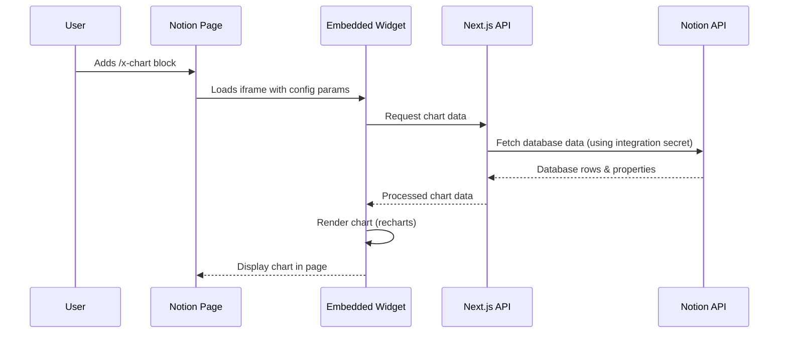

# Notion Charts Integration - Proof of Concept

## Architecture Overview

The integration consists of:

1. **Next.js API routes** for Notion API proxy using integration secret
2. **Embeddable widget** (iframe-compatible React component) that Notion can embed
3. **Chart configuration UI** for selecting database and fields
4. **Chart rendering** using recharts library with MUI styling

## Data Flow



## Implementation Plan

### 1. Project Setup

- Initialize Next.js project with TypeScript
- Install dependencies: `@notionhq/client`, `recharts`, `@mui/material`, `@mui/icons-material`
- Configure environment variables for Notion integration secret

### 2. Notion API Client Setup

- Create Notion API client wrapper using integration secret
- Initialize client with secret from environment variables
- Handle API errors and rate limiting

### 3. Embeddable Widget Component

- Create `/embed` page that renders chart widget
- Accept URL parameters: `database_id`, `chart_type`, `field_mappings`
- Implement responsive iframe-friendly layout
- Add loading and error states

### 4. Chart Configuration UI

- Build configuration panel in widget for:
  - Database selection (list user's databases)
  - Field selection (properties from selected database)
  - Chart type selection (line, bar, pie)
  - Data aggregation options (if needed)
- Save configuration to URL params or localStorage

### 5. Data Fetching & Processing

- Create `/api/chart-data` endpoint that:
  - Uses integration secret to authenticate with Notion API
  - Fetches database from Notion API
  - Processes rows based on field mappings
  - Transforms data for chart library format
  - Returns structured chart data

### 6. Chart Rendering

- Implement chart components using recharts:
  - `LineChart` component
  - `BarChart` component
  - `PieChart` component
- Style with MUI theme
- Add chart interactions (tooltips, legends)

### 7. Synchronization

- Implement on-access data fetching (no caching for PoC)
- Add refresh button in widget
- Show last sync timestamp

## File Structure

```
/
├── app/
│   ├── api/
│   │   └── chart-data/route.ts          # Fetch & process data
│   ├── embed/
│   │   └── page.tsx                     # Embeddable widget page
│   └── layout.tsx
├── components/
│   ├── ChartWidget.tsx                  # Main widget component
│   ├── ChartConfig.tsx                  # Configuration UI
│   └── charts/
│       ├── LineChart.tsx
│       ├── BarChart.tsx
│       └── PieChart.tsx
├── lib/
│   ├── notion.ts                        # Notion API client wrapper
│   └── chart-processor.ts               # Data transformation
├── types/
│   └── notion.ts                        # TypeScript types
└── .env.local                           # Environment variables
```

## Key Implementation Details

### Authentication Flow

- Use Notion private integration with integration secret
- Secret stored in environment variable (server-side only)
- No user authentication required - integration has access to connected workspaces

### Chart Data Processing

- Map Notion property types to chart data:
  - `number` → numeric values
  - `date` → time series
  - `select`/`multi_select` → categories
  - `title` → labels

### Widget Embedding

- Widget page accepts query params: `db_id`, `type`, `fields`
- Renders in iframe-friendly container (no scrollbars)
- Responsive design for different embed sizes

## Environment Variables Required

```
NOTION_INTEGRATION_SECRET=
```

## Next Steps After PoC

- Add caching layer for performance
- Support more chart types
- Add export functionalit