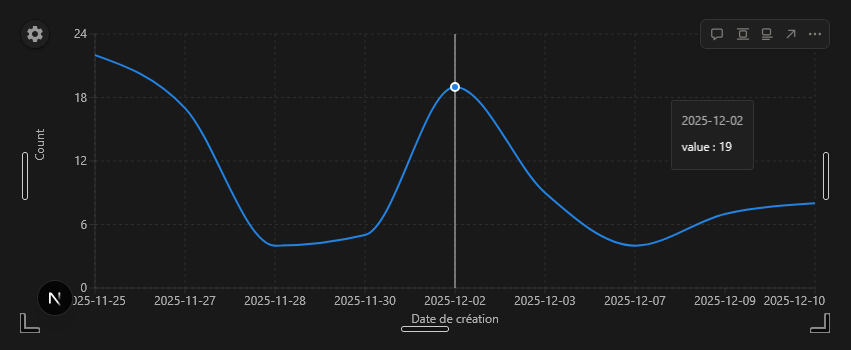

# Notion charts

Proof-of-concept a system to embed charts in Notion, using data from Notion databases.

## Features

- Embbeded widget in notion
- Chart synchronization
- Chart based on notion data

## Example



## How to use

```bash
npm install
npm run dev
```

Open `http://localhost:3000/embed` to test in a full web page.

### Test in an actual Notion page

1. Create a new embed block, with url `https://localhost:3000`
2. Open browser dev tools and locate the corresponding iframe
3. Update the `src` attribute of the iframe to set it to `https://localhost:3000` (without the `s` on `http`)
4. It will work until you refresh the page.

NB: You can setup a custom user script (GreaseMonkey-like) to automatically update
iframes'src attribute in notion.so pages when the `src` matches `^https://localhost:\d+`.
