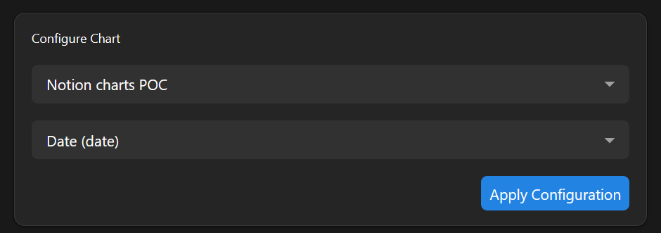
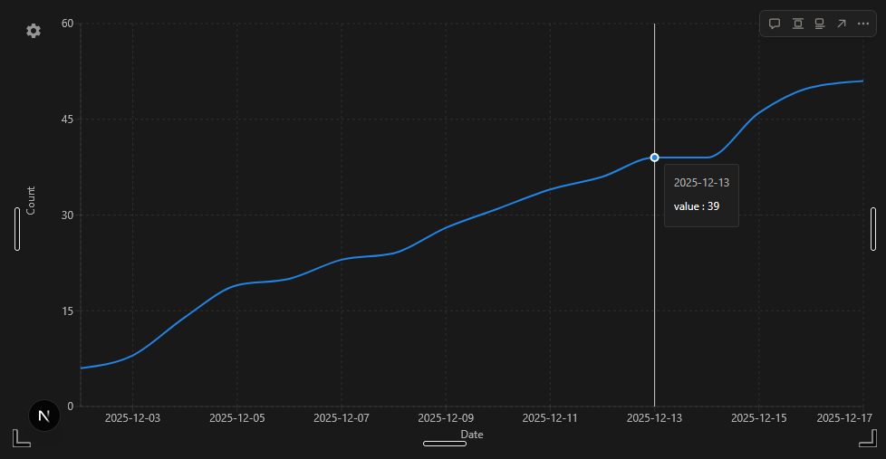

# Notion charts

Proof-of-concept a system to embed charts in Notion, using data from Notion databases.

## Features

- Embbeded widget in notion
- Chart synchronization
- Chart based on notion data

## Example



---



## How to use

### 1. Clone this repository

```bash
git clone git@github.com:Doreapp/notion-charts.git
cd notion-charts
```

### 2. Create a Notion integration

1. Open https://www.notion.so/profile/integrations/
2. Press "New integration"
3. Choose a name and a workspace
4. Select "Internal" as Type
5. Save
6. Display and copy the integration's secret

### 3. Configure the app

```bash
cp .env.example .env.local
```

Then open `.env.local` and paste the integration secret as `NOTION_INTEGRATION_SECRET`.

### 4. Start the app

```bash
npm install
npm run dev
```

### 5. Access the app

Open `http://localhost:3000` to test in a full web page.

#### Test in an actual Notion page

1. Create a new embed block, with url `https://localhost:3000`
2. Open browser dev tools and locate the corresponding iframe
3. Update the `src` attribute of the iframe to set it to `https://localhost:3000` (without the `s` at `http`)
4. It will work until you refresh the page.

NB: You can setup a custom user script (GreaseMonkey-like) to automatically update
iframes' src attribute in notion.so pages when the `src` matches `^https://localhost:\d+`.
